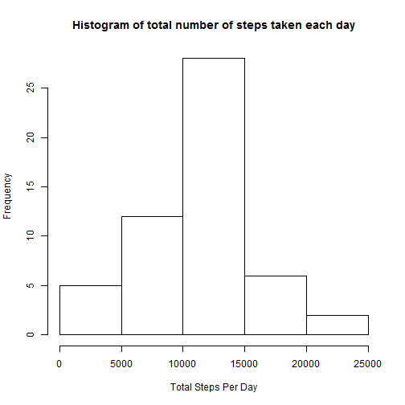
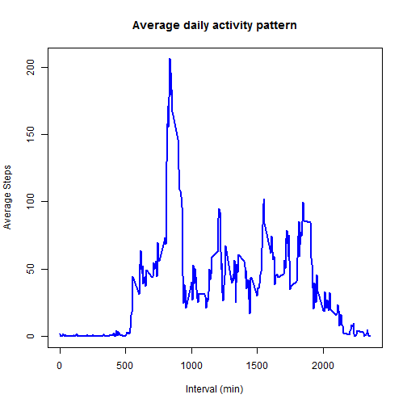
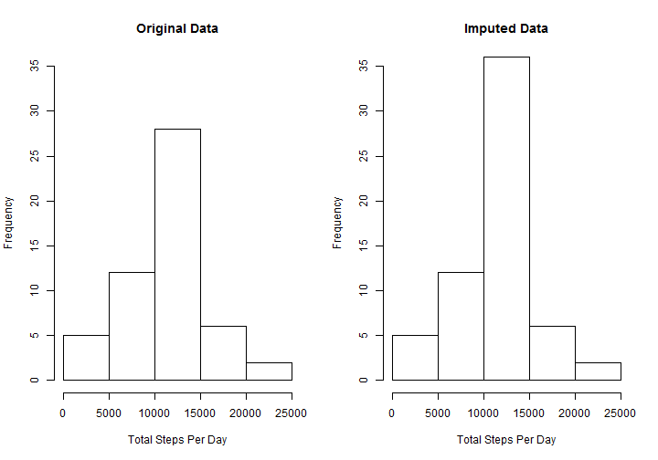
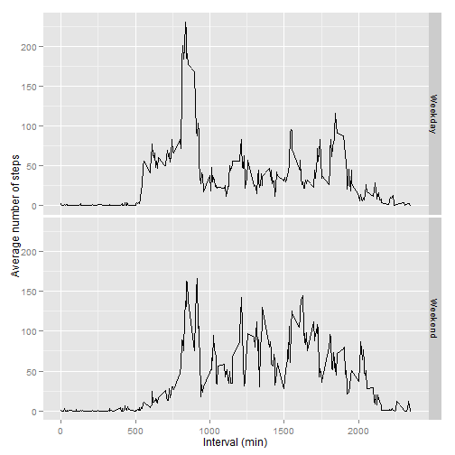

# Reproducible Research: Peer Assessment 1

## Loading and preprocessing the data  

To load the data, first download the zip file. Load the contents of the csv
file directly into the **data** by unzipping the **activity.csv** file from
the downloaded zip file. This requires the use of a temporary file which is
unlinked after reading and storing the data.  

Variable types for the **steps**, **date** and **interval** columns are 
identified as *numeric*, *char* and *numeric* respectively. The **date**
column is later converted from *char* type to *date* type.


```r
setInternet2(TRUE)

temp <- tempfile()
zipFileURL <- "https://d396qusza40orc.cloudfront.net/repdata%2Fdata%2Factivity.zip"
download.file(zipFileURL, temp)
varTypes <- c("numeric", "character", "numeric")
data <- read.table(unz(temp, "activity.csv"), header = TRUE, sep = ",", colClasses = varTypes)
data$date <- as.Date(data$date, "%Y-%m-%d")
unlink(temp)
```

## What is mean total number of steps taken per day?

### Histogram of the total number of steps taken each day  
First calculate total number of steps taken each day. For this we use the aggregate 
function as it ignores NAs by default.

```r
totalStepsPerDay <- aggregate(data$steps ~ data$date, FUN = sum)
colnames(totalStepsPerDay) <- c("date", "steps")
```

Next plot the histogram.

```r
hist(totalStepsPerDay$steps, main = "Histogram of total number of steps taken each day", 
    xlab = "Total Steps Per Day", ylab = "Frequency")
```

 


### Mean of total number of steps taken each day

```r
mean(totalStepsPerDay$steps)
```

```
## [1] 10766
```

### Median of total number of steps taken each day

```r
median(totalStepsPerDay$steps)
```

```
## [1] 10765
```


## What is the average daily activity pattern?
First calculate the average number of steps taken, averaged across all days 
for each time interval.

```r
avgStepsPerInterval <- aggregate(data$steps ~ data$interval, FUN = mean)
colnames(avgStepsPerInterval) <- c("interval", "steps")
```

Now plot time series.

```r
plot(avgStepsPerInterval$interval, avgStepsPerInterval$steps, type = "l", col = "blue", 
    lwd = 2, main = "Average daily activity pattern", xlab = "Interval (min)", 
    ylab = "Average Steps")
```

 

### Interval containing maximum number of steps

```r
avgStepsPerInterval$interval[avgStepsPerInterval$steps == max(avgStepsPerInterval$steps)]
```

```
## [1] 835
```

## Imputing missing values
### Total number of missing values in the dataset 
For this we will use the **complete.cases** function in R.

```r
length(complete.cases(data)[complete.cases(data) == FALSE])
```

```
## [1] 2304
```

Alternatively, this would work too (if known in advance that only the **steps** column 
contains NAs):  
**length(is.na(data$steps)[is.na(data$steps)==TRUE])**.

### Devise a strategy for filling in all of the missing values in the dataset. 
The mean for that 5-minute interval is used as the strategy for filling the 
NA values in the dataset. 
The **adply** function from the **plyr** package is used for this.
The new dataset is called **imputedData**. This is the same as the old 
dataset but with the missing data filled in.

```r
library(plyr)
imputedData <- adply(data, 1, function(x) if (is.na(x)) {
    x$step <- avgStepsPerInterval$step[avgStepsPerInterval$interval == x$interval]
} else {
    x$step <- x$step
})
imputedData$steps <- imputedData$V1  # Set new column V1 to steps column
imputedData$V1 <- NULL  # Delete new column
```

### Histogram of the total number of steps taken each day
Now using the **imputedData** dataframe
First calculate total number of steps taken each day. For this we use the aggregate 
function as it ignores NAs by default.

```r
totalStepsPerDayImputed <- aggregate(imputedData$steps ~ imputedData$date, FUN = sum)
colnames(totalStepsPerDayImputed) <- c("date", "steps")
```


Next plot the histogram and compare between the original and imputed data
side by side.

```r
par(mfrow = c(1, 2))
hist(totalStepsPerDay$steps, main = "Original Data", xlab = "Total Steps Per Day", 
    ylab = "Frequency", ylim = c(0, 35))
hist(totalStepsPerDayImputed$steps, main = "Imputed Data", xlab = "Total Steps Per Day", 
    ylab = "Frequency", ylim = c(0, 35))
```

 


### Mean of total number of steps taken each day

```r
mean(totalStepsPerDayImputed$steps)
```

```
## [1] 10766
```

### Median of total number of steps taken each day

```r
median(totalStepsPerDayImputed$steps)
```

```
## [1] 10766
```

One would not expect the mean and median to change using this scheme. As seen 
from the histograms the frequencies with the imputed data are increased as 
one would expect.

## Are there differences in activity patterns between weekdays and weekends?
### Create a new factor variable in the dataset with two levels -- "weekday" and "weekend" indicating whether a given date is a weekday or weekend day.

```r
imputedData$day <- imputedData$day <- as.factor(ifelse(weekdays(imputedData$date) %in% 
    c("Saturday", "Sunday"), "Weekend", "Weekday"))
```

To make panel plot of weekdays and weekend first compute the average steps per interval.

```r
avgStepsPerInterval <- aggregate(imputedData$steps ~ data$interval + imputedData$day, 
    FUN = mean)
colnames(avgStepsPerInterval) <- c("interval", "day", "steps")
```


Now plot for weekdays vs weekends. The ggplot2 package will be used for this.

```r
library(ggplot2)
p <- ggplot(avgStepsPerInterval, aes(interval, steps)) + geom_line()
# With one variable
p + facet_grid(day ~ .) + xlab("Interval (min)") + ylab("Average number of steps")
```

 

